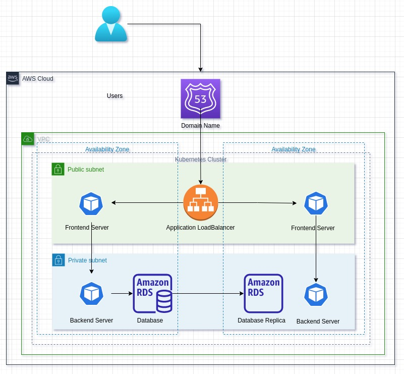

# GROUP 3 CAPSTONE PROJECT: TODO APP

## Executive Summary
The project aims to build a Todo application using Node.js, implementing CI/CD practices. The Todo application will provide users with the ability to create, update, delete, and retrieve todo items through a web interface. The implementation plan will focus on setting up a robust development environment, integrating version control systems, configuring CI/CD platforms, and facilitating continuous deployment. By leveraging CI/CD, the project seeks to automate the deployment process, ensuring faster and more reliable software delivery. 

## Introduction:
The purpose of this implementation plan is to outline the steps and strategies for building and deploying a Todo application using Node.js while incorporating Continuous Integration and Continuous Deployment (CI/CD) practices. The plan aims to streamline the development process, ensure code quality through automated testing, and enable efficient deployment cycles for the application. The application can be found at this [github repository](https://github.com/duoarc/node-todo-cicd).

### Scope and Goals:
The scope of this implementation plan encompasses the following components and practices:
- Service Providers:
a. Cloud Provider: Amazon Web Services (AWS) - : AWS is a leading cloud provider that offers a wide range of services, including compute, storage, database, networking, and more,  making it suitable for hosting of  application and infrastructure components. We chose AWS for this project because it offers a pay-as-you-go pricing model, which can help one to save money.it also offers strong security features for data protection and has a good track record of reliability and uptime .

- Services & Technologies:
a. Node.js: Chosen as the server-side runtime environment due to its event-driven architecture and JavaScript familiarity.

b. Express.js: A lightweight and flexible web framework for handling HTTP requests and routes.

c. PostgreSQL: A robust and reliable database for storing todo items.

d. Terraform: Use Terraform to define and provision the required AWS resources, including EC2 instances for the application, RDS for PostgreSQL, VPC, subnets, security groups, and other necessary components. Define the infrastructure in Terraform configuration files for version control and easy reproducibility.

e. Jenkins: Use Jenkins as the CI tool to automate the build, test, and deployment processes. Configure Jenkins pipelines to trigger on code changes, run tests, build Docker images, push them to a registry, and deploy to the Kubernetes cluster.

f. Kubernetes Manifests: Configuration files to define the deployment, services, and other resources for managing the application in a Kubernetes cluster ensuring scalability, fault tolerance, and easy scaling.

g. Monitoring and Logging: Implement monitoring tools like Prometheus and Grafana for metrics collection and visualization to ensure the stability and availability of the deployed application.

h. Docker: Utilize Docker to containerize the application, providing portability and ease of deployment

<b>The goals of this implementation plan are as follows:</b>

- Implement CI/CD practices to automate and streamline the development, testing, and deployment processes.
- Improve code quality and reduce manual errors through automated testing.
- Achieve faster deployment cycles, allowing for rapid delivery of new features and bug fixes.
- Enhance team collaboration and knowledge sharing through version control and CI/CD platforms.
- Ensure the stability and availability of the Todo application through monitoring and error handling mechanisms.

By achieving these goals, our team will be able to deliver a highly reliable and efficient Todo application, adapt to changing requirements with ease, and provide an exceptional user experience.

### Installation:
1. Set up your local machine
2. apt update
3. apt install nginx -y
4. apt install mongodb -y
5. apt install npm
6. npm i -g n
7. n 12 (exit and log back in to get the node 12 version)
8. clone the repo
9. cd to project
10. npm i -g yarn
11. yarn
12. node script.js
13. access the application in your web broswer using IPaddr:13371

    
### Architecture Diagram:
The architecture of the infrastructure that will host this application on AWS will consist of a Kubernetes Cluster with 3 pods. The architectural diagram consists of the following components:

1. Frontend: This is the entrypoint application pod.
   - User Interface (UI): This is the part of the application that users interact with. It can be built using HTML, CSS, and JavaScript.
   - Client-side logic: This includes any JavaScript code running on the frontend to handle user interactions, input validation, and rendering the UI.

2. Backend: The second pod will consist of the application logic,
   - API layer: This layer handles requests from the frontend and provides responses. It can be implemented using a Node.js framework like Express.js.
   - Business logic: This layer contains the core functionality of the application, such as creating, updating, and deleting todos. It may include authentication, authorization, and data validation.
   - Data Access layer: This layer interacts with the database or any other storage system. In a Node.js application, you can use an ORM (Object-Relational Mapping) like Sequelize or a query builder like Knex.js to interact with the database.
   - Database: This is where the todos and other application data are stored. You can use databases like MongoDB, MySQL, PostgreSQL, or any other database that is compatible with Node.js.

3. Communication:
   - HTTP(S) requests: The frontend communicates with the backend through HTTP(S) requests, typically using RESTful APIs or GraphQL.
   - JSON (or other data formats): Data is exchanged between the frontend and backend in a structured format like JSON (JavaScript Object Notation).

Overall, the frontend and backend components work together to provide a seamless user experience, with the frontend handling the UI and user interactions, while the backend manages the business logic, data storage, and communication with the frontend.

